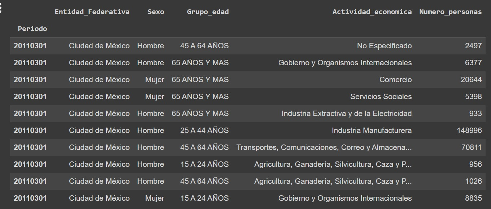
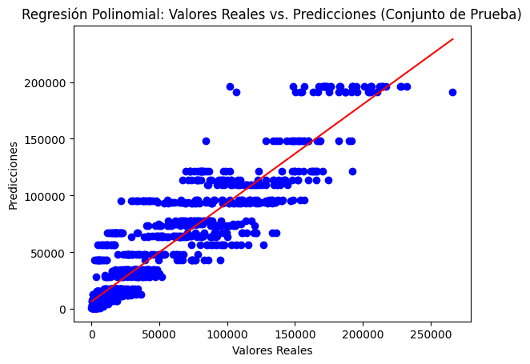

# Modulo de Machine Learning 
## 💰: Proyecto: Proyeccion Económica y Demanda Laboral
**Curso de procesamiendo de datos con Machine Learning, BEDU**   
*Ivanka Shaitd Benitez Rivera*   

---
### 📋: Introducción
El objetivo principal de este proyecto es analizar la relación entre las actividades económicas y el número de personas que se encuentran dentro de las miasmas, así como proyectar el impacto futuro de la demanda laboral en el mercado. 
Este proyecto se baso en el siguiente conjunto de datos: 
  - Indicadores Estratégicos/Población Ocupada por Actividad Económica.
    
Este incluye la información del país relacionada a las actividades economicas formales, el número de personas que se dedican a estas por sexo, edad y periodo de tiempo, abarcando desde el año 2011 a 2023. 

---

#### :dart: Objetivos y Tareas

- Recopilación de datos: Se obtendrán datos sobre actividades económicas y demanda laboral de fuentes gubernamentales y bases de datos especializadas.
- Procesamiento de datos: Los datos serán limpiados y preparados para el análisis, incluyendo la identificación y corrección de posibles errores.
- Análisis estadístico: Se aplicará regresión lineal para evaluar la relación entre la demanda de carreras y el campo laboral, considerando variables como la tasa de desempleo, la oferta educativa y otras variables relevantes.
- Proyección a futuro: Se utilizarán técnicas de modelado para prever el impacto de la demanda actual en la oferta laboral futura.

---
Se opto por trabajar desde el entorno de Google Colab, esto con el fin de poder colaborar en equipo, en donde inicialmente se contó con el siguiente conjunto de datos: 
- [actividades_economicas.csv](datasets/actividades_economicas.csv)

En donde se analizó la estructura de cada archivo para determinar era necesario crear nuevas tablas. Derivado de este análisis se concluyo que lo ideal sería sesgar el número de muestras a solo la Ciudad de México. 

--- 

#### 🇲🇽: Actividades Economicas exclusivamente en Ciudad de México

Una vez generado un conjunto de datos exclusivamente para la Ciudad de México (CDMX), se procedió a realizar un análisis visual mediante la creación de diversas gráficas. Entre estas, se incluyen:

1. [Distribución del empleo por grupo de edad.](imagenes/distr_empleo_edad.png)
2. [Número de personas por actividad económica.](imagenes/num_per_act.png)
3. [Número de personas por actividad por período.](imagenes/personas_act_periodo.png)
4. [Distribución del empleo por género y actividad económica.](imagenes/personas_act_periodo.png)

Estas gráficas se han elaborado con el objetivo de proporcionar una visualización clara y comprensible de los datos recopilados, permitiendo así un mejor entendimiento de la situación laboral en la CDMX.

--- 
#### 📈: Implementación Regresión lineal 

Implementación de Regresión Lineal
A continuación se encuentra la implementación de un modelo de Regresión Lineal utilizando Python y algunas de sus bibliotecas populares como pandas, scikit-learn y matplotlib.

Pasos a seguir:
##### 1. Importación de bibliotecas:
  - Utilizamos pandas para la manipulación y análisis de datos tabulares.
  - sklearn.model_selection para dividir los datos en conjuntos de entrenamiento y prueba.
  - sklearn.linear_model para construir y ajustar el modelo de regresión lineal.
  - sklearn.metrics para calcular el error cuadrático medio.
  - matplotlib.pyplot para visualizar la regresión lineal.

##### 2. Selección de características:
  Seleccionamos las características relevantes, como Grupo_edad y Actividad_economica, como variables independientes (X), y Numero_personas como la variable dependiente (y).
##### 3. Preprocesamiento de datos:
  Convertimos las características categóricas en variables dummy utilizando pd.get_dummies() para su uso en el modelo de regresión lineal.
##### 4. División de datos:
  Dividimos el conjunto de datos en conjuntos de entrenamiento (80%) y prueba (20%) utilizando train_test_split().
##### 5. Entrenamiento del modelo:
  Inicializamos un objeto LinearRegression() como nuestro modelo y lo ajustamos a los datos de entrenamiento con fit().
##### 6. Evaluación del modelo:
  Realizamos predicciones en el conjunto de prueba con predict() y calculamos el error cuadrático medio (MSE) entre las predicciones y los valores reales con mean_squared_error().
##### 7. Visualización de resultados:
  Imprimimos los coeficientes del modelo (las pendientes de las características) y el intercepto para comprender mejor la relación entre las variables.
  Visualizamos la [regresión lineal](imagenes/reg_lin_primera_prueba.png) trazando una gráfica de dispersión que muestra los valores reales versus las predicciones, lo que nos brinda una idea de qué tan bien se ajusta nuestro modelo a los datos.

--- 
#### 📈: Implementación Modelo de Regresión Polinomial 

Se realizó un código que implementa un modelo de regresión polinomial para predecir el número de personas (Numero_personas) en función de las características Grupo_edad y Actividad_economica. Donde se importaron las bibliotecas necesarias para el manejo de los datos, se definieron las caracteristicas y las caracteristicas categóricas. Una vez hecho esto, se dividió el conjunto de datos en conjuntos de entrenamiento, validación y pruebas, usando 'train_test_split()'. 

Este código es una implementación básica de regresión polinomial utilizando Python y las bibliotecas de aprendizaje automático de sklearn. 

Después de visualizar y analizar los resultados, concluimos que el modelo de regresión polinomial no fue efectivo en este caso. 

Nuestra interpretación se basa en los siguientes puntos:

- Error Cuadrático Medio (ECM): Observamos que tanto el ECM en el conjunto de validación como en el conjunto de pruebas son muy altos. Esto indica que el modelo no se ajusta bien a los datos, ya que hay una gran diferencia entre los valores reales y las predicciones del modelo.

- Coeficientes del Modelo: Al analizar los coeficientes del modelo, encontramos que son extremadamente grandes y variados en magnitud. Esto sugiere que el modelo está sobreajustado a los datos de entrenamiento, lo que resulta en coeficientes poco realistas y difíciles de interpretar. Además, el intercepto del modelo también es muy grande.

--- 

#### ☑️: Conclusiones

Después de probar tanto el modelo de regresión lineal simple como el modelo de regresión polinomial y encontrar que ninguno de ellos fue efectivo, podemos llegar a varias conclusiones:

- Complejidad del modelo: Ambos modelos, tanto el lineal como el polinomial, pueden haber sido demasiado simples o demasiado complejos para capturar la verdadera relación entre las características y la variable objetivo. El modelo lineal simple puede haber sido demasiado básico para capturar las relaciones no lineales en los datos, mientras que el modelo polinomial puede haber sido demasiado flexible y propenso al sobreajuste.

- Selección de características: Es posible que las características seleccionadas no hayan sido las más apropiadas para predecir la variable objetivo. Podría ser necesario explorar otras características o realizar un análisis más detallado para identificar las variables más relevantes para el problema en cuestión.

- Sobreajuste: El modelo de regresión polinomial claramente mostró signos de sobreajuste, como lo demuestran los coeficientes extremadamente grandes y variados. Esto sugiere que el modelo se ajustó demasiado a los datos de entrenamiento y no pudo generalizar bien a nuevos datos.
